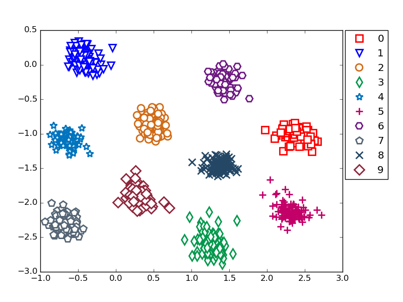

# SiameseNet-Label-spreading
## Abstract
$B?<AX5wN%3X=,$rMQ$$$?65;U%G!<%?@8@.(B@FSS2016$B$G;HMQ$7$?%=!<%9%3!<%I(B

## Requirements
-Python (checked Python 2.7.6)
-chainer(checked chainer 1.14.0

## Result
Plot feature vectors from MNIST images extracted by Siamese Net


To generate target data, apply graph-based semi-supervised learning method to them based on their data structures.
This method is really immature on generation of target data.
